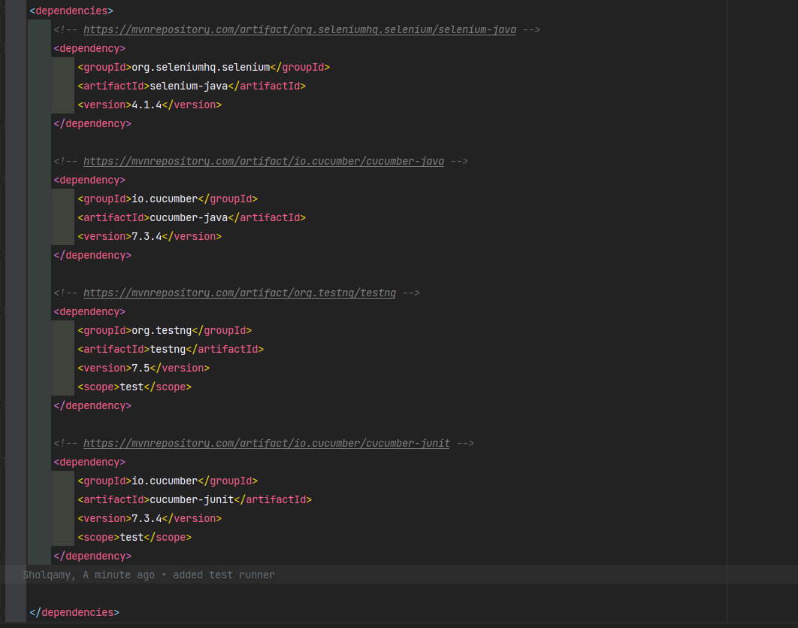

# Project is NOT done yet
# E-Commerce website UI Test automation

### This project is for UI test automation for an online shopping website [Link](https://demo.nopcommerce.com/)
---
This project is submitted to Udacity, FWD scholarship, FrontEnd performance testing nanodegree @April-cohort

### Test cases
| Scenario | Description                                         |
|----------|-----------------------------------------------------|
| SC_01    | User could register with valid data                 |
| SC_02    | User could log in with valid email and password     |
| SC_03    | User could reset his/her password successfully      |
| SC_04    | Logged User could search for any product            |
| SC_05    | Logged User could switch between currencies US-Euro |
| SC_06    | Logged user could select different Categories       |
| SC_07    | Logged user could filter with color                 |

---
- Screenshot of the environment variables
  
  
  
  ---

- Screenshot of the external libraries in the Maven project
  
  

  ---

- Screenshot of the Maven project settings
  

  ---

- Screenshot of the selected Maven stable version from the Maven website
  
  

  ---

- Screenshot(s) of Maven repository/website showing the selected & used versions of automation, assertion, and behavioral-driven frameworks
  
  
  

  ---

- Screenshot for IntelliJ plugins showing required Plugins installed
  

